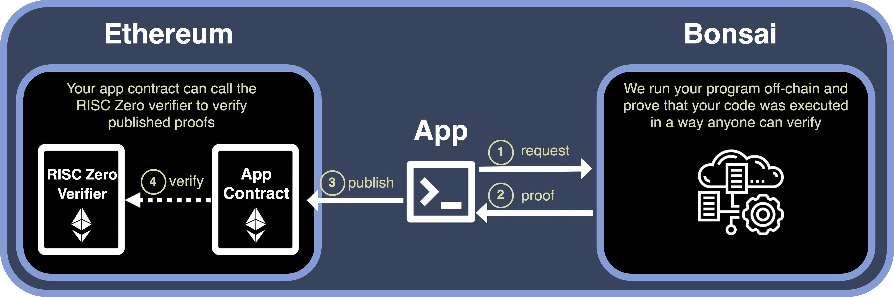

#CF Wallet RISC ZERO

The project goal is to build an Ethereum application capable of manage a wallet using your own Codice Fiscale (tax ID code). The system uses [RISC Zero] as a coprocessor to the smart contract application, moving the computationally-intensive process off-chain in the zkVM, saving gas fees and maintaining core values of decentralization.

We can trust the off-chain computation thanks to verifiable computations granted by ZK technology that generates a proof about the correct execution of Rust code. With this proof, anyone can verify that the computation ran correctly and produced the associated outputs.

Project flow:


###Project component
- [Application] (Rust): Serves as the project’s entry point, parsing input, initiating proof requests to Bonsai, and posting proofs to the Ethereum contract.
- [zkVM Program] (Rust): Defines the computation to be proven, specifically for digital signature verification.
- [Contracts] (Solidity): Manages on-chain operations. CFwallet.sol contains the core application logic, while CA_Storage.sol securely stores the public key of the eIDAS-compliant Certification Authority (CA).


The zkVM generate a proof of correct eIDAS-compliant digital signature verification. Once the proof is generated (using [Bonsai])  it is sent to smart contract, that verifies it using RiscZeroVerifier contract. If the verification is successful, the contract will decode the journal (public outputs within the receipt) to confirm the following:

- The salted CF, ensuring that the user who owns the contract is the one invoke the fund transfer.
- The issuer of the user’s certificate is an eIDAS-compliant Certification Authority (CA).

If one of the verification fails, the smart contract will revert the transaction.


##Run instructions

To run the project you have to install:
- Rust and Foundry
- rzup (needed to install cargo-risczero)
```bash
    curl -L https://risczero.com/install | bash
    rzup
    ```


##Project structure


[RISC Zero]: https://www.risczero.com/
[Bonsai]: https://risczero.com/bonsai

[Application]: ./app/
[zkVM Program]: ./methods/guest
[Contract]: ./contracts/
